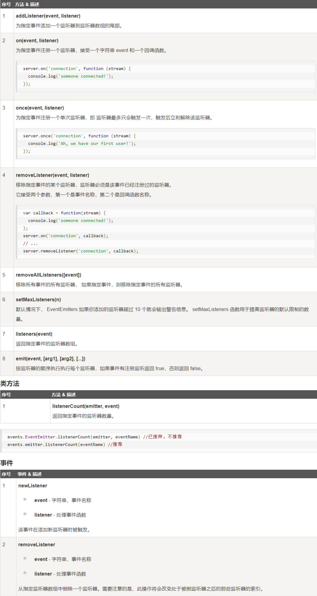

<!--
 * @Author: angula
 * @Date: 2020-09-21 20:23:25
 * @LastEditTime: 2020-09-22 11:41:28
 * @FilePath: \JS\Github-前端知识总结仓库\studySummary\Node.js学习笔记\事件循环\事件循环.md
-->
# 事件循环

Node.js 是单进程单线程应用程序，但是因为 V8 引擎提供的异步执行回调接口，通过这些接口可以处理大量的并发，所以性能非常高。

Node.js 几乎每一个 API 都是支持回调函数的。

Node.js 基本上所有的事件机制都是用设计模式中观察者模式实现。

Node.js 单线程类似进入一个while(true)的事件循环，直到没有事件观察者退出，每个异步事件都生成一个事件观察者，如果有事件发生就调用该回调函数.

> 进程：CPU执行任务的模块
> 
> 线程：模块中的最小单元
> 

**举个通俗的例子：**

cpu比作我们每个人，到饭点吃饭了。可以点很多菜(cpu中的进程)：宫保鸡丁，鱼香肉丝，酸辣土豆丝。每样菜具体包含了哪些内容(cpu每个进程中的线程)：宫保鸡丁(详情：黄瓜、胡萝卜、鸡肉、花生米)。而详情构成了宫保鸡丁这道菜，吃了以后不饿。就可以干活了，cpu中的进程里的线程也是同理。当线程完成自己的内容将结果返回给进程，进程返回给cpu的时候。cpu就能处理日常需求。

- 单进程单线程：一盘炒苦瓜，里面只有苦瓜。
- 单进程多线程：一盘宫保鸡丁，里面有黄瓜、胡萝卜、鸡肉、花生米


## 事件驱动程序

Node.js使用事件驱动模型，当web server接收到请求，就把它关闭然后进行处理，然后去服务下一个web请求
当这个请求完成，它被放回处理队列，当到达队列开头，这个结果就返回给用户。

这个模型非常高效可扩展性非常强，因为 webserver 一直接受请求而不等待任何读写操作。（这也称之为非阻塞式IO或者事件驱动IO）

在事件驱动模型中，会生成一个主循环来监听事件，当检测到事件时触发回调函数。


整个事件驱动的流程就是这么实现的，非常简洁。有点类似于观察者模式，事件相当于一个主题(Subject)，而所有注册到这个事件上的处理函数相当于观察者(Observer)。

Node.js 有多个内置的事件，我们可以通过引入 events 模块，并通过实例化 EventEmitter 类来绑定和监听事件，如下实例：

```js
// 引入events模块
let events = require('events');
//创建eventEmitter对象
let eventEmitter = new events.EventEmitter();

//绑定事件以及事件处理程序
eventEmitter.on('eventName',eventHandler);

//通过程序触发事件
eventEmitter.emit('eventName')
```


示例：
```js
//引入events模块
let events = require('events');

//创建eventEmitter对象
let eventEmitter = new events.EventEmitter();

//创建事件处理程序
let connectHandle = function connected() {
  console.log('连接成功');
  //触发data_received事件
  eventEmitter.emit('data_received')
}

//绑定connection事件处理程序
eventEmitter.on('connection', connectHandle);

//使用匿名函数绑定data_received事件
eventEmitter.on('data_received', function () {
  console.log('数据接收成功');
})

//触发connecttion事件
eventEmitter.emit('connection');
console.log('程序执行完毕');


// 执行结果：
// 连接成功
// 数据接收成功
// 程序执行完毕
```

eventEmitter.emit 是触发事件（事件请求），eventEmitter.on是绑定处理事件的处理器（事件处理），事件的请求和处理是分开的，所以是异步。

## EventEmitter
node.js所有的异步I/O操作在完成时都会发送一个事件到事件队列

node.js里面的许多对象都会分发事件：一个net.Server对象会在每次有新连接时触发的一个事件，一个fs.readStream对象会在文件被打开的时候触发一个事件。所有这些产生事件的对象都是events.EventEmitter的实例

events 模块只提供了一个对象： events.EventEmitter。EventEmitter 的核心就是事件触发与事件监听器功能的封装。


EventEmitter 对象如果在实例化时发生错误，会触发 error 事件。当添加新的监听器时，newListener 事件会触发，当监听器被移除时，removeListener 事件被触发。

简单用法
```js
var EventEmitter = require('events').EventEmitter; 
var event = new EventEmitter(); 
event.on('some_event', function() { 
    console.log('some_event 事件触发'); 
}); 
setTimeout(function() { 
    event.emit('some_event'); 
}, 1000); 
```
运行这段代码，1 秒后控制台输出了 'some_event 事件触发'。
其原理是 event 对象注册了事件 some_event 的一个监听器，
然后我们通过 setTimeout 在 1000 毫秒以后向 event 对象发送事件 some_event，此时会调用some_event 的监听器。


> EventEmitter 的每个事件由一个事件名和若干个参数组成，事件名是一个字符串，通常表达一定的语义。对于每个事件，EventEmitter 支持 若干个事件监听器。
>
> 当事件触发时，注册到这个事件的事件监听器被依次调用，事件参数作为回调函数参数传递。

```js
var events = require('events'); 
var emitter = new events.EventEmitter(); 
emitter.on('someEvent', function(arg1, arg2) { 
    console.log('listener1', arg1, arg2); 
}); 
emitter.on('someEvent', function(arg1, arg2) { 
    console.log('listener2', arg1, arg2); 
}); 
emitter.emit('someEvent', 'arg1 参数', 'arg2 参数'); 
//输出：
// listener1 arg1 参数 arg2 参数
// listener2 arg1 参数 arg2 参数

```

以上例子中，emitter 为事件 someEvent 注册了两个事件监听器，然后触发了 someEvent 事件。

运行结果中可以看到两个事件监听器回调函数被先后调用。 这就是EventEmitter最简单的用法。

EventEmitter 提供了多个属性，如 on 和 emit。on 函数用于绑定事件函数，emit 属性用于触发一个事件。、

# EventEmitter属性



## 测试
```js
/*
 * @Author: angula
 * @Date: 2020-09-21 22:29:18
 * @LastEditTime: 2020-09-22 11:27:56
 * @FilePath: \JS\Github-前端知识总结仓库\studySummary\Node.js学习笔记\事件循环\index2.js
 */
let events = require('events');
let eventEmitter = new events.EventEmitter();

// 监听器1
let listener1 = function listener1() {
  console.log('监听器listener1启动。。。');
}

// 监听器2
let listener2 = function listener2() {
  console.log('监听器listener2启动。。。');
}

// 绑定connection事件，处理函数为listener1
eventEmitter.addListener('connection', listener1);
// 绑定connection事件，处理函数为listener2
eventEmitter.on('connection', listener2);


//类，返回监听器的数量

let eventListeners = eventEmitter.listenerCount('connection');
console.log(eventListeners + '个监听器监听连接事件。');


//处理connection事件
eventEmitter.emit('connection');

// 移除绑定的listener1
eventEmitter.removeListener('connection', listener1);
console.log('listener1不再受监听');

//触发连接事件
eventEmitter.emit('connection');

eventListeners = eventEmitter.listenerCount('connection');
console.log(eventListeners + '个监听器连接事件');

console.log('程序执行完毕');


```

执行结果：
